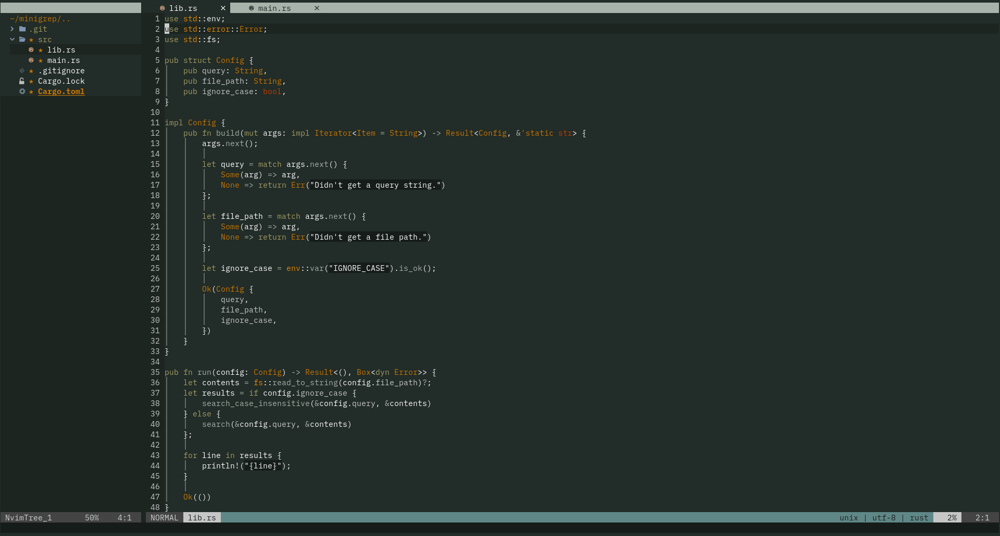

Monoindustrial Colorscheme for Neovim
===



## Requirements
- At minimum Neovim version 0.7
- A Neovim package manager of your choice

For example, if you're using [packer.nvim](https://github.com/wbthomason/packer.nvim) in your *init.lua* file include **monoindustrial-nvim**:
```
return require('packer').startup(function()
  use 'hisekai/monoindustrial-nvim'
end)
```

Then in your config specify the following:
```
vim.cmd [[colorscheme monoindustrial]]
```
____
## Sources and inspiration

While perusing the [Rust Playground](https://play.rust-lang.org/) I really liked the mono_industrial theme. Seeing that there wasn't any available for Neovim I tried to port it as closely as possible. Therefore all the credits for this colorscheme go to the author(s).

Lastly, this port was done using [Lush](https://github.com/rktjmp/lush.nvim)

